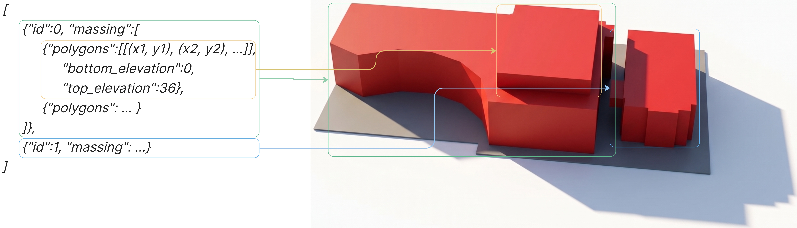
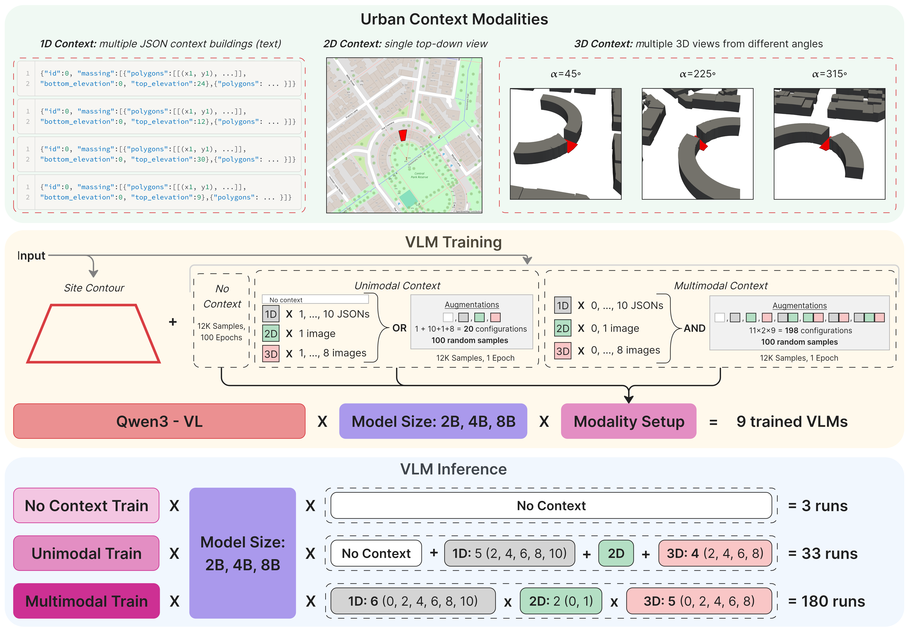
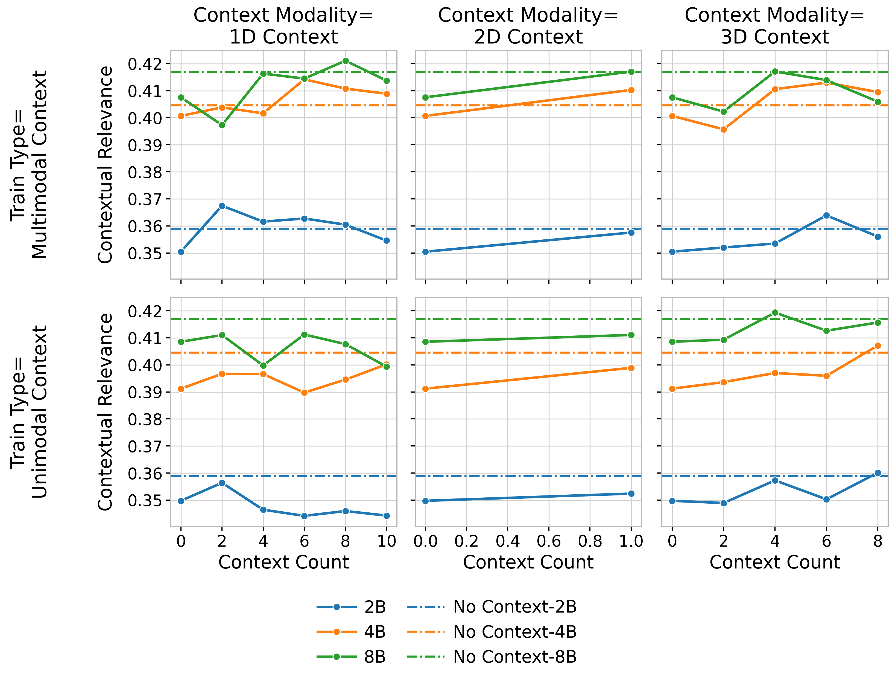
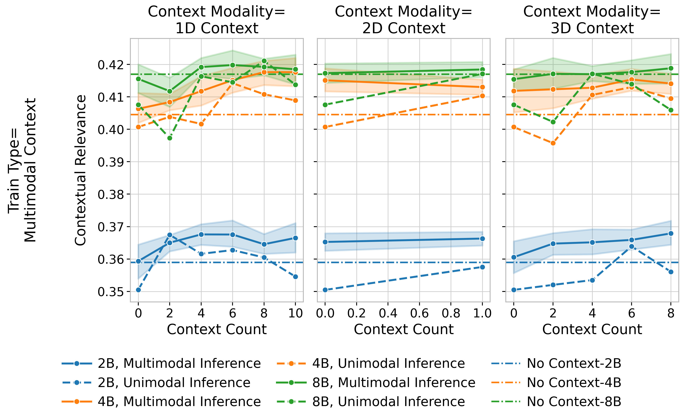

# CoMa: Contextual Massing Generation with Vision-Language Models

Code for the paper **CoMa: Contextual Massing Generation with Vision-Language Models** (MDPI *Smart Cities*, 2026).

This repository contains the dataset pipeline, VLM fine-tuning and inference code, the learned contextual-relevance (CR) metric, and the scripts used to reproduce the paper figures.

- Paper: [arXiv:2601.08464](https://arxiv.org/abs/2601.08464)
- Dataset, model weights, and inference outputs: [Zenodo](https://zenodo.org/records/21344986)
- Paper code: [GitHub](https://github.com/FusionBrainLab/CoMa)

---

## Paper

### Idea

Early-stage urban design needs **building massing**: editable 3D volumes that fit a parcel and also relate to the scale, density, and morphology of the surrounding fabric. The output should stay structured (JSON geometry that can be measured and edited). The context around the site is naturally multimodal: neighboring buildings as vector geometry, a top-down map, or 3D views.

CoMa treats this as a VLM generation task. A model receives a site contour and optional urban context, and writes LoD 1.3 massing geometry as JSON: buildings made of stacked extrusions, each with bottom/top elevations and footprint polygons.

<p align="center">
  
</p>
<p align="center"><em>LoD 1.3 massing encoded as a hierarchical JSON object: buildings → extrusions → polygons.</em></p>

To rank generators, the paper introduces a **learned contextual relevance metric**: a classifier that scores whether a massing–context pair looks like a genuine pair from the city, rather than a massing placed in a foreign neighborhood.

### Research questions

The experiments ask how VLMs use urban context for structured 3D massing, and how that depends on **which** context is shown and **how much** of it:

1. Does **multimodal training** (vector + map + 3D views in one regime) help a VLM use each **single** modality better at inference time than training on isolated modalities?
2. Does **multimodal inference** (combining modalities at test time) beat using one modality alone?

Secondary axes are model size (Qwen3-VL 2B / 4B / 8B) and the amount of 1D / 3D context.

### Experiment setup

The study uses **12,845 Melbourne massings** built from City of Melbourne open data (`property-boundaries` and `2023-building-footprints`). Split: 10,276 train / 2,569 test. Neighbors within 100 m define context.

Three context modalities:

- **1D** — JSON geometry of 1–10 neighboring massings (same schema as the output)
- **2D** — one top-down map view of the site (site highlighted)
- **3D** — 1–8 perspective renders around the site

Qwen3-VL 2B, 4B, and 8B are LoRA-fine-tuned under three regimes: **no context**, **unimodal context** (at most one modality per sample), and **multimodal context** (modalities may be combined). Inference then sweeps modality type, combinations, and context counts. Generation quality is scored with the learned CR metric.

<p align="center">
  
</p>
<p align="center"><em>Context modalities (1D / 2D / 3D), training regimes, and the inference grid over modality combinations and context amount.</em></p>

### Key results

**Multimodal training improves unimodal inference.** Models trained with mixed modalities usually score higher on a *single* test modality than models trained on that modality alone. More 1D neighbors or 3D views typically raise CR; the slope is clearer after multimodal training. Larger models help, with a bigger jump from 2B→4B than 4B→8B.

<p align="center">
  
</p>
<p align="center"><em>Unimodal inference: contextual relevance vs amount of 1D / 2D / 3D context, for unimodal vs multimodal training.</em></p>

**Multimodal inference is stronger than isolated modalities.** For multimodally trained models, combining 1D, 2D, and 3D beats using any one of them. Vector geometry and 3D views carry complementary structure; the top-down map helps most when the other two are scarce. Best reported configuration: **8B, multimodal training, 6×1D + 2D + 8×3D** (CR 0.435).

<p align="center">
  
</p>
<p align="center"><em>Multimodal vs unimodal inference for each modality (solid = combined with other modalities; short dash = that modality alone).</em></p>

An orientation-feature ablation of the CR metric (appendix) weakens the metric but does not reverse these conclusions.

---

## Code

Python building blocks live in `src/` (Hydra-instantiable dataset, metric, training, and visualization components). Everything that reproduces the paper sits under `experiments/`.

### Where the paper experiments are

| Paper step | Location |
|---|---|
| Dataset construction (Melbourne tables → massings, neighbors, images, train/test split) | `experiments/data_processing/coma/pipeline/` (`main.py`, `split.py`) |
| Model training (Qwen3-VL 2B/4B/8B × no / unimodal / multimodal context) | `experiments/training/coma/qwen3/` |
| CR metric training and selection | `experiments/benchmarks/coma/metrics_validation/` |
| Model validation / inference grid | `experiments/benchmarks/coma/methods_validation/` |
| Paper figures | `experiments/benchmarks/coma/results_visualization/` |
| Orientation ablation of the CR metric | `experiments/benchmarks/coma/run_no_orientation_ablation.py` |

Related extras in the same benchmark folder:

- `validation_scripts/` — Hydra `--multirun` wrappers over the inference grid
- `split_evaluation/` — spatial train/test context-overlap analysis from the appendix

Layout of a training run:

```
experiments/training/coma/qwen3/
  configs/                  # shared model, tokenizer, context sampler, collator
  no_context/{2B,4B,8B}/
  unimodal_context/{2B,4B,8B}/
  multimodal_context/{2B,4B,8B}/
```

Each size folder has a Hydra `config_single.yaml` (training graph) and an MLS `run_single.yaml` (cluster job). `save_model_config.yaml` merges LoRA adapters after training.

### How to run

Set `REPO_ROOT` to the repository root (shell scripts and `hydra_run.py` do this if you do not). Paths in YAML use `${oc.env:REPO_ROOT}`. Optional: `MASSING_METRIC_ROOT` if metric artifacts live outside the clone (defaults to `REPO_ROOT`).

**Hydra, one job.** Instantiates `cfg.method` and calls it:

```bash
python hydra_run.py --config_path experiments/training/coma/qwen3/no_context/2B/config_single.yaml
```

The same entrypoint drives metric training, scoring, and figure configs, for example:

```bash
python hydra_run.py --config_path experiments/benchmarks/coma/metrics_validation/train_ensemble_config.yaml
python hydra_run.py --config_path experiments/benchmarks/coma/results_visualization/visualization_configs/publication/crossmodal_line_grid_visualization.yaml
```

Extra CLI tokens after `--config_path` are Hydra overrides. Inference grids use `--multirun`, as in `experiments/benchmarks/coma/validation_scripts/`:

```bash
HYDRA_FULL_ERROR=1 python hydra_run.py \
  --config_path experiments/benchmarks/coma/validation_config.yaml \
  --multirun \
  model_size=2,4,8 \
  train_type=multimodal_context \
  context_1d_count=0,2,4,6,8,10 \
  context_2d_count=0,1 \
  context_3d_count=0,2,4,6,8
```

**Hydra, several jobs in parallel.** `hydra_batch_run.py` takes a base config plus a batch file of per-run overrides and starts one `hydra_run.py` process per run (used by methods validation):

```bash
python hydra_batch_run.py \
  --base_config experiments/benchmarks/coma/methods_validation/configs/base.yaml \
  --batch_config experiments/benchmarks/coma/methods_validation/configs/batch_2b_4b.yaml
```

**MLS job YAML.** Files named `run_single.yaml` under `experiments/training/...` are cluster job specs (not Hydra). They set `REPO_ROOT` / `HF_HOME` / `CUDA_HOME` and run `hydra_run.py` on the matching `config_single.yaml`. Inference grids can also be submitted from `experiments/benchmarks/coma/methods_validation/run.py`.

**Ablation.** Retrain the CR metric without orientation features, rescore generations, redraw figures:

```bash
python experiments/benchmarks/coma/run_no_orientation_ablation.py
```

Conda environment dumps used for the paper runs are under `experiments/benchmarks/coma/env/` and `experiments/benchmarks/coma/methods_validation/env/`.

---

## Data

Datasets and model weights are not stored as raw files in git. Each artifact is tracked by a DVC pointer (a `*.dvc` file) next to the path where the data belongs. The actual content is published as a [Zenodo](https://zenodo.org/records/21344986) archive whose directory tree matches this repository: unpacking it recovers the files at the same relative paths as the corresponding DVC pointers.

For example, `experiments/training/coma/qwen3/no_context/2B/checkpoints.dvc` in the clone corresponds to `experiments/training/coma/qwen3/no_context/2B/checkpoints` in the archive (same pattern for dataset splits, metric artifacts, and inference outputs).
